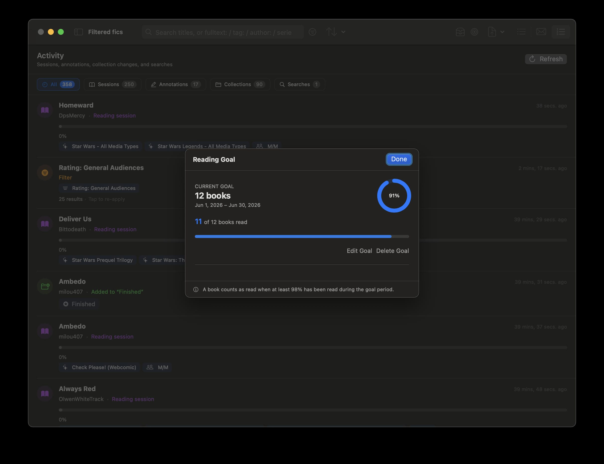
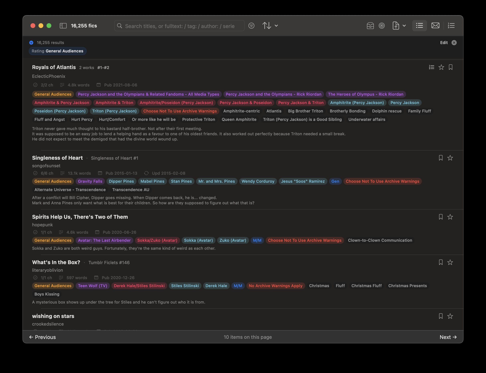
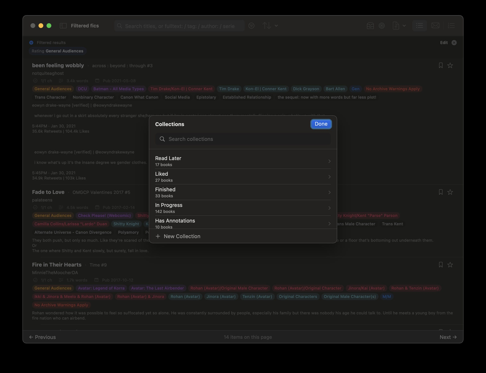
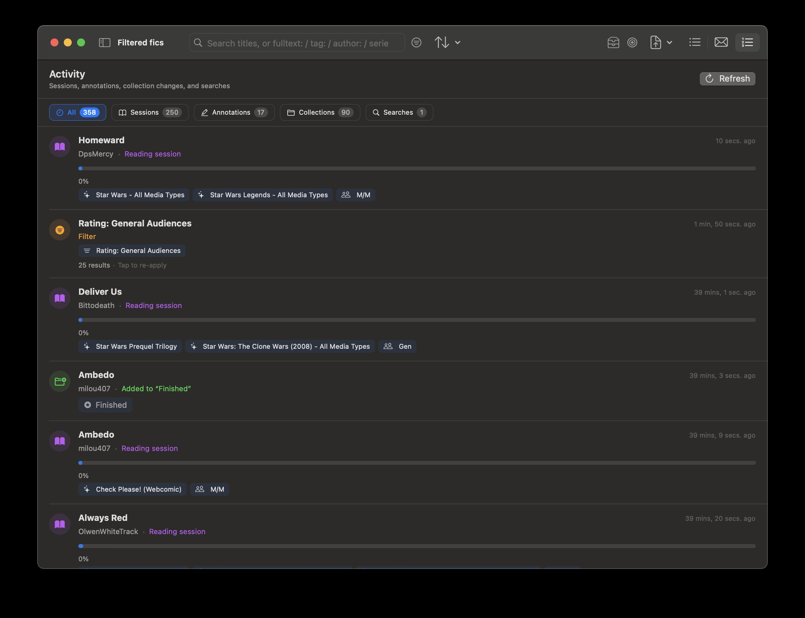
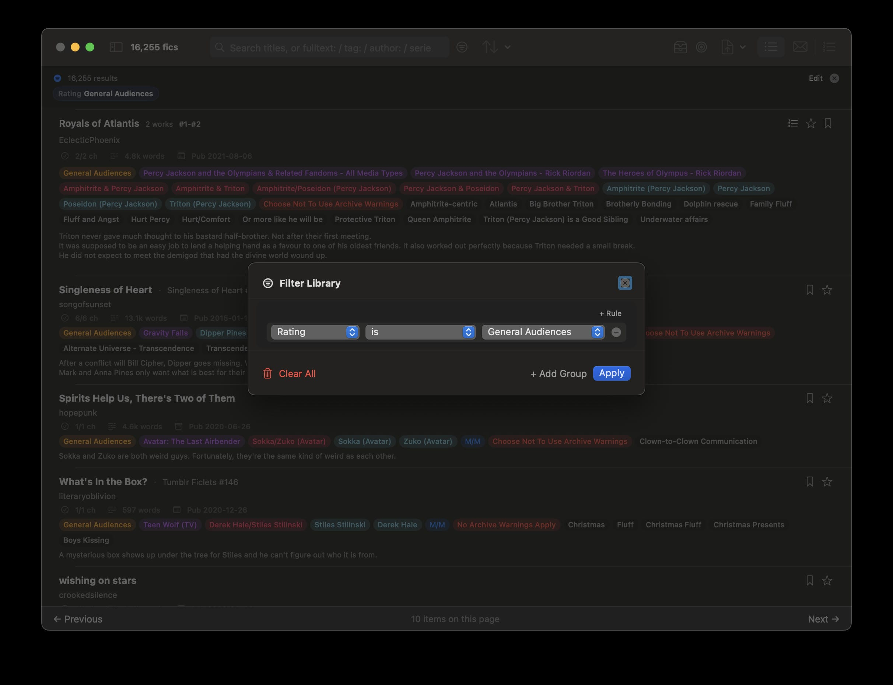
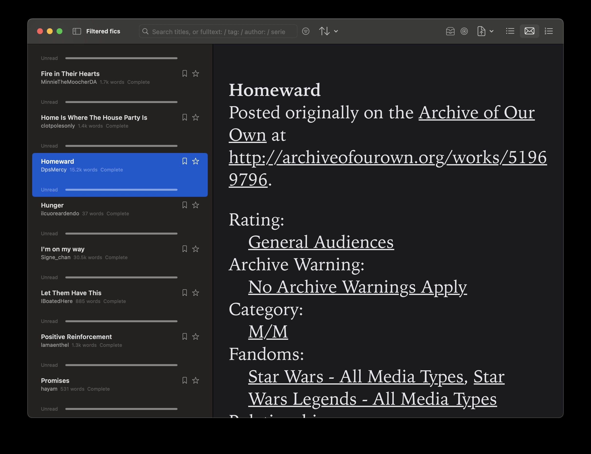
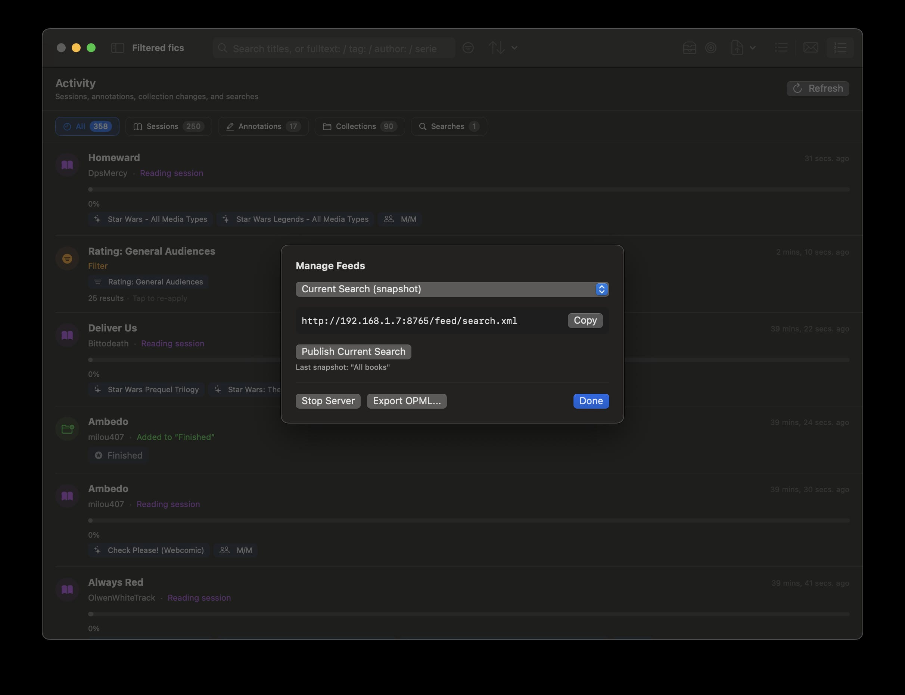

# Ambrosia

Ambrosia is a native macOS EPUB library reader for AO3-heavy Calibre libraries. It reads Calibre's `metadata.db`, renders EPUBs in a custom reader, and stores Ambrosia-only state in a separate per-library database.

## Screenshots

<details>
  <summary>📸 Click to expand screenshot gallery (7 Images)</summary>
  <br>
  <p align="center">
    
    
    
    
    
    
    
  </p>
</details>

## Features

- Opens an existing Calibre library folder with `metadata.db`.
- Reads Calibre metadata read-only, including authors, tags, series, comments, custom columns, and EPUB file locations.
- Provides list, email-style, and activity library modes, search prefixes, filter rules, pagination, and optional Calibre full-text-search fallback.
- Extracts AO3 EPUB preface metadata into a per-library `ambrosia_meta.db`, including fandoms, relationships, characters, additional tags, categories, word counts, chapter counts, AO3 series, and extraction diagnostics.
- Supports system collections (Read Later, Liked, Skipped, Finished, In Progress, Has Annotations, Series or Merged) as well as user-created, renameable collections.
- Groups collapsed series through cached AO3/Calibre series metadata and tracks merged or anthology-style works in Series or Merged.
- Renders EPUBs with a custom `WKWebView` reader in scroll or paginated mode, including a table-of-contents popup and continuous reading across an entire series in one window.
- Stores highlights and point annotations in `ambrosia_meta.db`.
- Tracks reading goals against a configurable period, and surfaces an activity feed of recent reading sessions, annotations, collection changes, and searches.
- Includes CSV export, an optional local read-only RSS feed server, and reader/library preferences.
- Can import an external AO3 tag seed database for canonical tag and synonym expansion, with in-app validation feedback.
- Remembers recently opened Calibre libraries.

## Installation

Download Ambrosia.dmg.

Either use command to bypass Gatekeeper or right-click, open, allow.
```zsh
sudo xattr -rd com.apple.quarantine /path/to/Ambrosia.app
```


## Requirements

- macOS 14.0 or newer.
- Xcode with Swift support.
- A Calibre library folder containing `metadata.db`.
- Swift packages resolved by the Xcode project:
  - SQLite.swift
  - ZIPFoundation
  - SwiftSoup
  - FlyingFox

## Build

Open `Ambrosia.xcodeproj` in Xcode and build the `Ambrosia` scheme, or run:

```bash
rtk xcodebuild -scheme Ambrosia -destination 'platform=macOS' build
```

The repository uses Xcode/SPM package management. Do not hand-edit `Package.resolved`; add or update packages through Xcode.

## Library Setup

Ambrosia expects a Calibre library directory, not an individual EPUB folder. (Will be supported later.) The selected folder must contain:

- `metadata.db`
- Calibre's normal author/book subfolders and EPUB files
- optionally `full-text-search.db` for FTS-backed plain-text search

On first open, Ambrosia records the library path and creates its own writable database under:

```text
~/Library/Application Support/Ambrosia/libraries/<library-hash>/ambrosia_meta.db
```

Calibre's `metadata.db` remains read-only. Ambrosia also keeps a small local index of libraries you've opened, so recently used libraries are easy to reopen.

## Usage Quick Start

1. Launch Ambrosia.
2. Choose a Calibre library folder.
3. Browse in list mode, email mode, or the activity feed.
4. Search with plain text or prefixes such as `tag:`, `author:`, `title:`, and `series:`.
5. Open an EPUB in the reader — open a single book, or open an entire series to read continuously in one window, with a table-of-contents popup available in either case.
6. Use reader preferences to switch typography, spacing, colors, window sizing, paginated columns, and scroll/paginated mode.
7. Add annotations or highlights from the reader.
8. Organize books into system or custom collections, and set a reading goal for the current period.
9. Export visible library results to CSV when needed.

AO3 metadata extraction runs in the background after a library opens. The library remains usable while extraction proceeds.

## Data Model

Ambrosia separates storage ownership:

- Calibre `metadata.db`: read-only source of truth for book metadata and EPUB file paths.
- SwiftData store: reading state and reading goals.
- Ambrosia `ambrosia_meta.db`: per-library app-owned state, including collections, annotations, AO3 metadata, AO3 diagnostics, series cache, series placeholders, reading history, and tag synonym tables.
- UserDefaults: app preferences, selected library path, and lightweight configuration.


## Privacy

Ambrosia is a local macOS app. It reads local Calibre libraries and writes local Ambrosia support files. Current developer-preview functionality does not require cloud sync or network services. Future AO3 account features are not implemented.

## Contributing

This is a work-in-progress app. Keep changes scoped, preserve Calibre read-only behavior, and verify with `xcodebuild` before claiming a clean build. Documentation-only changes should at least pass:

## License

This project is licensed under the MIT license.

#### Note to self

Use create-dmg to generate dmg.
